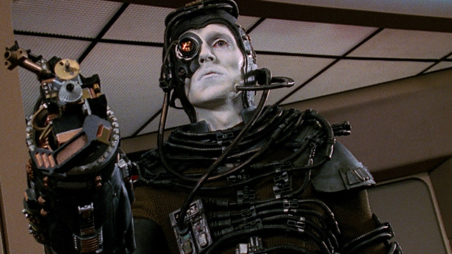

# markdown-practice

FOUNDATIONS

whatever

# BIG heading

---

## Medium heading

---

### small heading

---

**bold boi**

_leaning boi_

_leaning boi's brother_

## #Bullets

- This
  - is
    - a nested
      - and bulleted
        - list

`" a single of code "`

```

const = a larger block of code;

```

> I am a quote boi

_-quote boi_



_~ [ICE BORG FAN HEADQUARTERS](https://memory-alpha.fandom.com/wiki/Borg) _~

| Borg Element | Attributes             | Phone Number          |
| ------------ | ---------------------- | --------------------- |
| FIRE BORG    | grumpy, but powerful   | 1 (800) fire-borg.com |
| ICE BORG     | coolest guy on the bus | 1-900-ROCKNROLL       |
| WATER BORG   | depressed              | disconnected          |


---

_I HAVE ADDED A BRAND NEW BRANCH_

---


